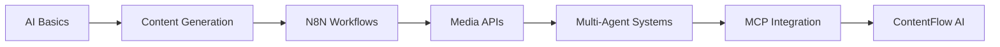

# AI Automation Engineer Workshop

A comprehensive 3-day workshop for learning intelligent automation with AI, Claude, and N8N.

## 🎯 Workshop Overview

This intensive workshop teaches you how to build intelligent automation solutions using modern AI technologies. You'll learn to design, implement, and deploy AI-powered workflows that can transform creative and business processes.

### What You'll Build

Throughout this workshop, you'll build **ContentFlow AI** - a sophisticated multi-agent content creation system that:
- 🎨 Generates images, videos, and audio using AI (fal.ai)
- 📝 Creates compelling written content across multiple formats
- 🖼️ Integrates stock photography from Unsplash/Pexels
- 🤖 Orchestrates multiple AI agents for different creative tasks
- 📊 Manages content pipelines from ideation to publication
- 🔄 Implements feedback loops and quality control

## 📋 Prerequisites

- Basic programming knowledge (any language)
- Understanding of APIs and HTTP requests
- Familiarity with JSON data format
- Laptop with Windows, macOS, or Linux
- Accounts for:
  - Claude AI (Anthropic)
  - N8N (self-hosted or cloud)
  - GitHub

## 🛠 Setup Instructions

### 1. Install Required Software

```bash
# Install Node.js (v18 or higher)
# Download from: https://nodejs.org

# Install N8N globally
npm install -g n8n

# Install Git
# Download from: https://git-scm.com
```

### 2. Clone Workshop Repository

```bash
git clone https://github.com/workshops-de/workshop-ai-automation-engineer.git
cd workshop-ai-automation-engineer
```

### 3. Set Up N8N

```bash
# Start N8N
n8n start

# Access N8N at: http://localhost:5678
# Create your account and save credentials
```

### 4. Configure Claude AI

1. Sign up at https://claude.ai or get API access at https://console.anthropic.com
2. Generate an API key
3. Keep it secure - you'll need it during the workshop

## 📚 Workshop Structure

### Day 1: Foundations & First Content Agent
- AI and LLM fundamentals
- Prompt engineering for creative tasks
- Introduction to N8N
- Building your first content generation workflow

### Day 2: Multi-Agent Systems & Media Generation
- API integration with fal.ai
- Stock photo integration (Unsplash/Pexels)
- Building specialized content agents
- Agent orchestration patterns

### Day 3: Production Systems & MCP Integration
- MCP server implementation
- Production deployment strategies
- Content pipeline optimization
- Complete ContentFlow AI system

## 📁 Repository Structure

```
workshop-ai-automation-engineer/
├── README.md                 # This file
├── agenda/                   # Detailed workshop agenda
│   ├── day-1.md
│   ├── day-2.md
│   └── day-3.md
├── slides/                   # Slide content for presentations
│   ├── 01-ai-basics/
│   ├── 02-problem-solving/
│   └── ...
├── exercises/                # Hands-on exercises
│   ├── 01-first-workflow/
│   ├── 02-api-integration/
│   └── ...
├── project/                  # ContentFlow AI project files
│   ├── workflows/
│   ├── agents/
│   ├── content/
│   └── documentation/
├── resources/                # Additional learning resources
│   ├── cheat-sheets/
│   ├── templates/
│   └── links.md
└── solutions/                # Exercise solutions
```

## 🚀 Getting Started

1. Complete the setup instructions above
2. Review the [Day 1 Agenda](agenda/day-1.md)
3. Open the [first exercise](exercises/01-first-workflow/README.md)
4. Join our workshop Discord for support

## 💡 Learning Path



## 🎓 After the Workshop

- Access to all materials remains available
- Join our community for ongoing support
- Regular updates with new techniques
- Certificate of completion

## 📞 Support

- **Workshop Discord**: [Join Here]
- **Email**: workshop@workshops.de
- **Documentation**: [Workshop Wiki]

## 📄 License

This workshop material is proprietary to workshops.de. 
All rights reserved. For educational use during the workshop only.

---

**Ready to become an AI Automation Engineer? Let's build something amazing together! 🚀**
