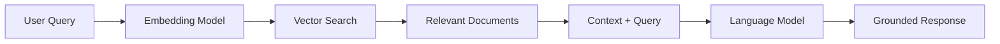

# Exercise 0: Building a RAG Knowledge System

## 🎯 Learning Goals
- Understand RAG (Retrieval-Augmented Generation) concepts
- Set up vector stores for document storage
- Implement embedding models
- Build semantic search capabilities
- Create AI agents with knowledge bases

## 📋 Prerequisites
- N8N with AI nodes
- Access to embedding models (OpenAI/Cohere/HuggingFace)
- Vector store (Pinecone/Qdrant/Simple Vector Store)
- Basic understanding of AI concepts

## 🔨 Task Description

Build a complete RAG system that allows AI agents to access and use external knowledge sources for accurate, grounded responses.

### Part 1: Understanding RAG Architecture (15 min)

#### What is RAG?

RAG (Retrieval-Augmented Generation) enhances AI responses by:
1. **Retrieving** relevant information from external sources
2. **Augmenting** the AI prompt with this context
3. **Generating** responses based on retrieved knowledge



#### Key Components

```javascript
// RAG System Components
const ragSystem = {
  // 1. Vector Store - Stores document embeddings
  vectorStore: {
    type: 'pinecone', // or 'qdrant', 'simple'
    dimension: 1536,   // OpenAI embedding dimension
    metric: 'cosine'   // Similarity metric
  },
  
  // 2. Embedding Model - Converts text to vectors
  embeddingModel: {
    provider: 'openai',
    model: 'text-embedding-ada-002',
    dimension: 1536
  },
  
  // 3. Text Splitter - Chunks documents
  textSplitter: {
    type: 'recursive',
    chunkSize: 500,
    chunkOverlap: 50
  },
  
  // 4. Retriever - Finds relevant chunks
  retriever: {
    topK: 5,          // Return top 5 chunks
    threshold: 0.7    // Minimum similarity score
  }
};
```

### Part 2: Setting Up Vector Store (25 min)

#### Insert Documents into Vector Store

```javascript
// Document Ingestion Pipeline
class DocumentIngestion {
  constructor(vectorStore, embedder, splitter) {
    this.vectorStore = vectorStore;
    this.embedder = embedder;
    this.splitter = splitter;
  }
  
  async ingestDocument(document) {
    // 1. Split document into chunks
    const chunks = await this.splitter.split(document);
    
    // 2. Generate embeddings for each chunk
    const embeddings = await Promise.all(
      chunks.map(chunk => this.embedder.embed(chunk.text))
    );
    
    // 3. Prepare for vector store
    const vectors = chunks.map((chunk, i) => ({
      id: `doc_${document.id}_chunk_${i}`,
      values: embeddings[i],
      metadata: {
        text: chunk.text,
        documentId: document.id,
        documentTitle: document.title,
        chunkIndex: i,
        totalChunks: chunks.length,
        source: document.source,
        timestamp: new Date().toISOString()
      }
    }));
    
    // 4. Insert into vector store
    await this.vectorStore.upsert(vectors);
    
    return {
      documentId: document.id,
      chunksCreated: chunks.length,
      tokensUsed: this.calculateTokens(chunks)
    };
  }
  
  calculateTokens(chunks) {
    // Rough estimation: 1 token ≈ 4 characters
    return chunks.reduce((total, chunk) => 
      total + Math.ceil(chunk.text.length / 4), 0
    );
  }
}
```

#### Text Splitting Strategies

```javascript
// Different splitting strategies for different content types
class TextSplittingStrategies {
  // Recursive Character Splitter - Best for most cases
  recursiveSplit(text, options = {}) {
    const {
      chunkSize = 500,
      chunkOverlap = 50,
      separators = ['\n\n', '\n', '. ', ' ', '']
    } = options;
    
    const chunks = [];
    let currentChunk = '';
    
    // Split by separators hierarchically
    for (const separator of separators) {
      const parts = text.split(separator);
      
      for (const part of parts) {
        if ((currentChunk + part).length <= chunkSize) {
          currentChunk += part + separator;
        } else {
          if (currentChunk) chunks.push(currentChunk);
          currentChunk = part;
        }
      }
    }
    
    if (currentChunk) chunks.push(currentChunk);
    
    // Add overlap
    return this.addOverlap(chunks, chunkOverlap);
  }
  
  // Token-based Splitter - For token-limited models
  tokenSplit(text, maxTokens = 500) {
    const words = text.split(' ');
    const chunks = [];
    let currentChunk = [];
    let currentTokens = 0;
    
    for (const word of words) {
      const wordTokens = Math.ceil(word.length / 4);
      
      if (currentTokens + wordTokens > maxTokens) {
        chunks.push(currentChunk.join(' '));
        currentChunk = [word];
        currentTokens = wordTokens;
      } else {
        currentChunk.push(word);
        currentTokens += wordTokens;
      }
    }
    
    if (currentChunk.length > 0) {
      chunks.push(currentChunk.join(' '));
    }
    
    return chunks;
  }
  
  // Markdown Splitter - Preserves document structure
  markdownSplit(text) {
    const sections = text.split(/^#+ /m);
    return sections.filter(s => s.trim().length > 0);
  }
}
```

### Part 3: Querying with RAG (25 min)

#### Implement Semantic Search

```javascript
// RAG Query System
class RAGQuerySystem {
  constructor(vectorStore, embedder, llm) {
    this.vectorStore = vectorStore;
    this.embedder = embedder;
    this.llm = llm;
  }
  
  async query(question, options = {}) {
    const {
      topK = 5,
      threshold = 0.7,
      includeMetadata = true
    } = options;
    
    // 1. Embed the question
    const questionEmbedding = await this.embedder.embed(question);
    
    // 2. Search vector store
    const searchResults = await this.vectorStore.query({
      vector: questionEmbedding,
      topK: topK,
      filter: {
        score: { $gte: threshold }
      },
      includeMetadata: includeMetadata
    });
    
    // 3. Extract relevant chunks
    const relevantChunks = searchResults.matches.map(match => ({
      text: match.metadata.text,
      score: match.score,
      source: match.metadata.source
    }));
    
    // 4. Build augmented prompt
    const augmentedPrompt = this.buildPrompt(question, relevantChunks);
    
    // 5. Generate response with LLM
    const response = await this.llm.generate(augmentedPrompt);
    
    return {
      answer: response,
      sources: relevantChunks.map(c => c.source),
      confidence: this.calculateConfidence(relevantChunks)
    };
  }
  
  buildPrompt(question, chunks) {
    const context = chunks.map(c => c.text).join('\n\n');
    
    return `You are a helpful assistant. Answer the question based only on the provided context.
    If the context doesn't contain enough information, say so.
    
    Context:
    ${context}
    
    Question: ${question}
    
    Answer:`;
  }
  
  calculateConfidence(chunks) {
    if (chunks.length === 0) return 0;
    
    const avgScore = chunks.reduce((sum, c) => sum + c.score, 0) / chunks.length;
    return Math.min(1, avgScore * 1.2); // Boost slightly, cap at 1
  }
}
```

### Part 4: Using RAG with Agents (20 min)

#### RAG-Enabled Agent Implementation

```javascript
// AI Agent with RAG capabilities
class RAGAgent {
  constructor(name, vectorStore, tools = []) {
    this.name = name;
    this.vectorStore = vectorStore;
    this.tools = tools;
    this.memory = [];
  }
  
  async process(userQuery) {
    // 1. Check if knowledge retrieval is needed
    const needsRetrieval = await this.assessQuery(userQuery);
    
    if (needsRetrieval) {
      // 2. Retrieve relevant knowledge
      const knowledge = await this.retrieveKnowledge(userQuery);
      
      // 3. Augment query with knowledge
      const augmentedQuery = this.augmentQuery(userQuery, knowledge);
      
      // 4. Generate response
      const response = await this.generateResponse(augmentedQuery);
      
      // 5. Add citations
      return this.addCitations(response, knowledge);
    } else {
      // Direct response without RAG
      return await this.generateResponse(userQuery);
    }
  }
  
  async assessQuery(query) {
    // Determine if query needs external knowledge
    const knowledgeIndicators = [
      'what is', 'how does', 'explain', 'define',
      'according to', 'based on', 'documentation'
    ];
    
    return knowledgeIndicators.some(indicator => 
      query.toLowerCase().includes(indicator)
    );
  }
  
  async retrieveKnowledge(query, limit = 5) {
    const results = await this.vectorStore.query({
      query: query,
      limit: limit
    });
    
    return results.map(r => ({
      content: r.text,
      source: r.metadata.source,
      relevance: r.score
    }));
  }
  
  augmentQuery(query, knowledge) {
    const knowledgeText = knowledge
      .map(k => `[Source: ${k.source}]\n${k.content}`)
      .join('\n\n');
    
    return {
      systemPrompt: `You are a knowledgeable assistant with access to specific information.
        Use the provided context to answer questions accurately.
        Always cite your sources when using external knowledge.`,
      
      userPrompt: `Context Information:\n${knowledgeText}\n\nUser Question: ${query}`,
      
      instructions: [
        'Answer based on the provided context',
        'If context is insufficient, acknowledge limitations',
        'Cite sources using [Source: name] format',
        'Be concise but complete'
      ]
    };
  }
  
  addCitations(response, knowledge) {
    const sources = [...new Set(knowledge.map(k => k.source))];
    
    return {
      answer: response,
      sources: sources,
      citations: knowledge.map(k => ({
        source: k.source,
        relevance: k.relevance
      }))
    };
  }
}
```

### Part 5: Optimization & Best Practices (15 min)

#### Embedding Model Selection

```javascript
// Choosing the right embedding model
const embeddingModels = {
  // Small & Fast - Good for simple queries
  'text-embedding-ada-002': {
    dimension: 1536,
    cost: 0.0001,  // per 1K tokens
    speed: 'fast',
    quality: 'good',
    useCase: 'General purpose, cost-effective'
  },
  
  // Large & Accurate - Better semantic understanding
  'text-embedding-3-large': {
    dimension: 3072,
    cost: 0.0004,  // per 1K tokens
    speed: 'medium',
    quality: 'excellent',
    useCase: 'Complex documents, high accuracy needs'
  },
  
  // Open Source Alternative
  'all-MiniLM-L6-v2': {
    dimension: 384,
    cost: 0,  // Self-hosted
    speed: 'very fast',
    quality: 'moderate',
    useCase: 'Budget-conscious, privacy-focused'
  }
};

function selectEmbeddingModel(requirements) {
  if (requirements.budget === 'low' && requirements.privacy === 'high') {
    return 'all-MiniLM-L6-v2';
  }
  
  if (requirements.accuracy === 'critical') {
    return 'text-embedding-3-large';
  }
  
  return 'text-embedding-ada-002'; // Balanced choice
}
```

#### Chunk Size Optimization

```javascript
// Finding optimal chunk size
class ChunkOptimizer {
  async findOptimalSize(document, testQueries) {
    const sizes = [200, 500, 1000, 1500];
    const results = [];
    
    for (const size of sizes) {
      const chunks = this.splitDocument(document, size);
      const score = await this.evaluateRetrieval(chunks, testQueries);
      
      results.push({
        size: size,
        score: score,
        numChunks: chunks.length
      });
    }
    
    return results.sort((a, b) => b.score - a.score)[0].size;
  }
  
  async evaluateRetrieval(chunks, queries) {
    let totalScore = 0;
    
    for (const query of queries) {
      const retrieved = await this.retrieve(query, chunks);
      const relevance = this.measureRelevance(retrieved, query.expectedAnswer);
      totalScore += relevance;
    }
    
    return totalScore / queries.length;
  }
}
```

## 💡 Best Practices

1. **Chunk Strategy**: Use recursive splitting with 10-20% overlap
2. **Metadata**: Always include source, timestamp, and context
3. **Hybrid Search**: Combine vector search with keyword search
4. **Caching**: Cache embeddings for frequently accessed documents
5. **Updates**: Implement versioning for document updates

## ✅ Success Criteria

- [ ] Vector store configured and operational
- [ ] Documents successfully ingested
- [ ] Semantic search returning relevant results
- [ ] RAG agent answering from knowledge base
- [ ] Citations properly included in responses

## 🚀 Bonus Challenge

Build an "Intelligent Document Assistant" that:
1. Auto-categorizes uploaded documents
2. Suggests related documents
3. Generates document summaries
4. Answers complex multi-hop questions
5. Updates knowledge base automatically

## 📊 Expected Output

```json
{
  "rag_system": {
    "vector_store": "pinecone",
    "documents_indexed": 150,
    "total_chunks": 3500,
    "embedding_model": "text-embedding-ada-002",
    "avg_chunk_size": 500
  },
  "query_test": {
    "question": "What is our refund policy?",
    "chunks_retrieved": 5,
    "relevance_scores": [0.92, 0.88, 0.85, 0.81, 0.78],
    "response_time": "1.2s",
    "answer": "According to our policy documentation...",
    "sources": ["RefundPolicy.pdf", "CustomerService.md"]
  },
  "performance": {
    "avg_query_time": "850ms",
    "accuracy_score": 0.89,
    "token_usage": 450,
    "cost_per_query": "$0.002"
  }
}
```

## 🔗 Resources

- [n8n RAG Documentation](https://docs.n8n.io/advanced-ai/rag-in-n8n/)
- [Vector Store Comparison](../../resources/vector-stores.md)
- [Embedding Models Guide](../../resources/embeddings.md)

## Next Steps
With RAG fundamentals mastered, you're ready to build sophisticated knowledge-based AI systems!
