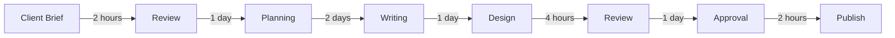

# Exercise 3.1: Process Mapping for ContentFlow AI

## 🎯 Learning Goals
- Analyze content creation workflows systematically
- Identify automation opportunities
- Design efficient process architectures
- Define success metrics and KPIs

## 📋 Prerequisites
- Understanding of content creation workflows
- Basic knowledge of process mapping
- Completed exercises 1.1 and 2.1

## 🔨 Task Description

Map out CreativeHub Agency's content creation process and design the ContentFlow AI architecture to automate it.

### Part 1: Current State Analysis (20 min)

#### Scenario: CreativeHub's Current Process
The agency currently handles content creation manually:
1. Client sends brief via email
2. Account manager reviews and clarifies requirements
3. Content strategist creates content plan
4. Writer produces first draft
5. Designer creates visuals
6. Editor reviews and revises
7. Client approves
8. Social media manager publishes

**Your Task:** Create a process flow diagram identifying:
- Time spent at each step
- Bottlenecks and delays
- Repetitive tasks
- Error-prone areas

#### Process Mapping Template


### Part 2: Automation Opportunities (25 min)

Identify which tasks can be automated with AI:

| Process Step | Automation Potential | AI Agent Required | Expected Time Saving |
|--------------|---------------------|-------------------|---------------------|
| Brief Analysis | High | Research Agent | 90% |
| Content Planning | High | Strategy Agent | 80% |
| First Draft | High | Writing Agent | 85% |
| Visual Creation | High | Visual Agent | 75% |
| Review | Medium | QC Agent | 50% |
| Publishing | High | Publishing Agent | 95% |

### Part 3: Future State Design (30 min)

Design the automated ContentFlow AI process:

#### Automated Workflow Architecture
```
1. Intake System
   - Webhook receives client brief
   - AI extracts requirements
   - Validates completeness
   
2. Content Planning
   - Research Agent gathers insights
   - Strategy Agent creates plan
   - Generates content calendar
   
3. Content Creation
   - Writing Agent produces copy
   - Visual Agent creates images
   - Video Agent generates media
   
4. Quality Control
   - QC Agent reviews output
   - Checks brand guidelines
   - Flags issues for human review
   
5. Publishing
   - Formats for each platform
   - Schedules posts
   - Tracks performance
```

### Part 4: Success Metrics Definition (15 min)

Define KPIs for ContentFlow AI:

#### Efficiency Metrics
- Time from brief to publication
- Number of pieces created per day
- Cost per content piece
- API usage optimization

#### Quality Metrics
- Client approval rate
- Revision requests
- Engagement rates
- Brand consistency score

#### Business Metrics
- Client satisfaction (NPS)
- Revenue per client
- Operational cost reduction
- ROI of automation

### Part 5: Risk Assessment (10 min)

Identify potential risks and mitigation strategies:

| Risk | Probability | Impact | Mitigation |
|------|------------|--------|------------|
| AI generates off-brand content | Medium | High | Implement brand guidelines checker |
| API service downtime | Low | High | Multi-provider fallback |
| Quality below human standard | Medium | Medium | Human-in-the-loop review |
| Client resistance to AI | Medium | High | Gradual rollout, transparency |

## 💡 Implementation Blueprint

```yaml
# ContentFlow AI Process Configuration
process:
  name: "Content Creation Pipeline"
  version: "1.0"
  
stages:
  - intake:
      trigger: "webhook"
      agents: ["Parser", "Validator"]
      sla: "5 minutes"
      
  - planning:
      agents: ["Research", "Strategy"]
      parallel: true
      sla: "15 minutes"
      
  - creation:
      agents: ["Writing", "Visual", "Video"]
      parallel: true
      sla: "30 minutes"
      
  - review:
      agents: ["QC", "Brand"]
      requires_human: "on_flag"
      sla: "10 minutes"
      
  - publishing:
      agents: ["Formatter", "Scheduler"]
      platforms: ["LinkedIn", "Twitter", "Blog"]
      sla: "5 minutes"

metrics:
  track:
    - "total_time"
    - "api_costs"
    - "quality_score"
    - "client_satisfaction"
```

## ✅ Success Criteria

- [ ] Mapped current manual process completely
- [ ] Identified 5+ automation opportunities
- [ ] Designed future state architecture
- [ ] Defined 10+ success metrics
- [ ] Created risk mitigation plan

## 🚀 Bonus Challenge

Create a "Process Optimization Calculator" that:
1. Calculates current process costs (time × hourly rate)
2. Estimates automated process costs (API + overhead)
3. Projects ROI over 6 months
4. Identifies break-even point

Example calculation:
```
Current: 8 hours × $50/hour = $400 per campaign
Automated: $5 API costs + 0.5 hours oversight = $30
Savings: $370 per campaign (92.5% reduction)
Monthly volume: 100 campaigns
Monthly savings: $37,000
```

## 📊 Process Metrics Dashboard

Design a dashboard showing:
- Average time per stage
- Bottleneck identification
- Success/failure rates
- Cost per content type
- Quality scores

## 🔗 Resources

- [Business Process Modeling Guide](../../resources/process-modeling.md)
- [Automation ROI Calculator](../../resources/roi-calculator.xlsx)
- [KPI Templates](../../resources/kpi-templates.md)

## 📝 Solution

<details>
<summary>Click to reveal optimal process design</summary>

### Optimal ContentFlow AI Architecture

```python
class ContentFlowProcess:
    def __init__(self):
        self.stages = [
            IntakeStage(timeout=300),  # 5 min
            PlanningStage(timeout=900),  # 15 min
            CreationStage(timeout=1800),  # 30 min
            ReviewStage(timeout=600),  # 10 min
            PublishingStage(timeout=300)  # 5 min
        ]
        
    def process(self, brief):
        context = {"brief": brief, "metrics": {}}
        
        for stage in self.stages:
            start = time.time()
            try:
                context = stage.execute(context)
                context["metrics"][stage.name] = time.time() - start
            except Exception as e:
                return self.handle_error(stage, e, context)
                
        return context
        
    def handle_error(self, stage, error, context):
        # Implement fallback strategies
        if stage.has_fallback:
            return stage.fallback(context)
        else:
            # Route to human operator
            return self.escalate_to_human(context)
```

### Key Success Factors
1. **Parallel Processing**: Run independent tasks simultaneously
2. **Smart Caching**: Reuse common elements (brand voices, templates)
3. **Progressive Enhancement**: Start simple, add complexity
4. **Human Oversight**: Strategic checkpoints for quality
5. **Continuous Learning**: Feedback loop for improvement

</details>

## Next Exercise
[Exercise 4.1: Building Your First N8N Workflow →](../04-n8n-basics/first-workflow.md)
