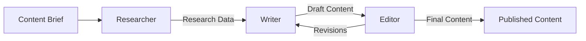

# Exercise 5.1: Building Your First Multi-Agent Content System

## 🎯 Learning Goals
- Combine Claude AI with N8N workflows
- Implement agent communication patterns
- Create specialized content agents
- Orchestrate multi-step content creation

## 📋 Prerequisites
- Completed Exercise 4.1 (N8N workflow)
- Claude AI integration working
- Understanding of workflow concepts

## 🔨 Task Description

Build your first multi-agent system where different AI agents collaborate to create comprehensive content packages.

### Part 1: Agent Architecture Design (20 min)

#### Define Your Agents

```yaml
agents:
  researcher:
    role: "Content Research Specialist"
    capabilities:
      - Topic analysis
      - Keyword research
      - Competitor analysis
      - Trend identification
    
  writer:
    role: "Content Writer"
    capabilities:
      - Blog post creation
      - Social media copy
      - Email newsletters
      - SEO optimization
    
  editor:
    role: "Content Editor"
    capabilities:
      - Grammar checking
      - Fact verification
      - Brand voice alignment
      - Quality scoring
```

#### Communication Flow


### Part 2: Implement Research Agent (25 min)

#### Research Agent Workflow

```javascript
// Research Agent Node
const ResearchAgent = {
  systemPrompt: `You are a content research specialist.
    Your job is to gather comprehensive information about topics.
    Always provide:
    - Key points to cover
    - Target keywords
    - Competitor insights
    - Trending angles
    Output in JSON format.`,
  
  async research(topic, audience) {
    const prompt = `Research topic: "${topic}"
      Target audience: ${audience}
      
      Provide:
      1. 5 key points to cover
      2. 10 relevant keywords
      3. 3 competitor content examples
      4. 2 trending angles
      5. Suggested content structure`;
    
    const response = await callClaude(this.systemPrompt, prompt);
    return JSON.parse(response);
  }
};

// N8N Function Node Implementation
const topic = $json.topic;
const audience = $json.audience;

const researchPrompt = `
Research the topic: "${topic}"
Target audience: ${audience}

Provide a JSON response with:
{
  "keyPoints": ["point1", "point2", ...],
  "keywords": ["keyword1", "keyword2", ...],
  "competitors": [{"title": "", "url": "", "strength": ""}],
  "trendingAngles": ["angle1", "angle2"],
  "structure": {
    "introduction": "approach",
    "sections": ["section1", "section2"],
    "conclusion": "approach"
  }
}
`;

return {
  research: researchPrompt,
  timestamp: new Date().toISOString()
};
```

### Part 3: Implement Writing Agent (25 min)

#### Writing Agent with Research Context

```javascript
// Writing Agent Node
const WritingAgent = {
  systemPrompt: `You are a professional content writer.
    You create engaging, SEO-optimized content.
    Use research data to inform your writing.
    Maintain brand voice and style guidelines.`,
  
  async writeContent(research, contentType, requirements) {
    const prompt = `
      Based on this research: ${JSON.stringify(research)}
      
      Create a ${contentType} with these requirements:
      - Length: ${requirements.length} words
      - Tone: ${requirements.tone}
      - Keywords to include: ${research.keywords.join(', ')}
      
      Structure:
      ${JSON.stringify(research.structure)}
    `;
    
    return await callClaude(this.systemPrompt, prompt);
  }
};

// N8N Implementation
const research = $node["Research Agent"].json;
const contentType = $json.contentType || "blog post";

const writePrompt = `
Using this research data:
${JSON.stringify(research)}

Write a ${contentType} that:
- Is ${$json.targetLength} words long
- Uses a ${$json.tone} tone
- Includes these keywords naturally: ${research.keywords.slice(0, 5).join(', ')}
- Follows this structure: ${JSON.stringify(research.structure)}

Format with clear headings and sections.
`;

return {
  content: writePrompt,
  metadata: {
    type: contentType,
    research: research,
    requestedAt: new Date().toISOString()
  }
};
```

### Part 4: Implement Editor Agent (20 min)

#### Quality Control and Editing

```javascript
// Editor Agent Node
const EditorAgent = {
  systemPrompt: `You are a senior content editor.
    Review content for:
    - Grammar and spelling
    - Factual accuracy
    - Brand voice consistency
    - SEO optimization
    - Readability
    Provide specific feedback and improvements.`,
  
  async editContent(content, guidelines) {
    const prompt = `
      Review this content:
      ${content}
      
      Guidelines:
      ${JSON.stringify(guidelines)}
      
      Provide:
      1. Quality score (1-10)
      2. Specific improvements needed
      3. SEO recommendations
      4. Final edited version
    `;
    
    const response = await callClaude(this.systemPrompt, prompt);
    return this.parseEditResponse(response);
  },
  
  parseEditResponse(response) {
    // Parse the editor's feedback
    return {
      qualityScore: 8,
      improvements: [],
      seoRecommendations: [],
      editedContent: response
    };
  }
};

// Quality Scoring System
function calculateQualityScore(content, research) {
  const scores = {
    keywordDensity: 0,
    readability: 0,
    structure: 0,
    brandVoice: 0,
    seoOptimization: 0
  };
  
  // Check keyword usage
  const keywords = research.keywords || [];
  const contentLower = content.toLowerCase();
  const keywordsFound = keywords.filter(k => 
    contentLower.includes(k.toLowerCase())
  ).length;
  scores.keywordDensity = (keywordsFound / keywords.length) * 10;
  
  // Simple readability check (sentence length)
  const sentences = content.split(/[.!?]+/);
  const avgSentenceLength = content.split(' ').length / sentences.length;
  scores.readability = avgSentenceLength < 20 ? 10 : 
                       avgSentenceLength < 30 ? 7 : 5;
  
  // Calculate overall score
  const totalScore = Object.values(scores).reduce((a, b) => a + b, 0);
  return {
    overall: (totalScore / Object.keys(scores).length).toFixed(1),
    breakdown: scores
  };
}
```

### Part 5: Orchestration Layer (20 min)

#### Coordinate All Agents

```javascript
// Main Orchestration Workflow
class ContentOrchestrator {
  constructor() {
    this.agents = {
      researcher: new ResearchAgent(),
      writer: new WritingAgent(),
      editor: new EditorAgent()
    };
  }
  
  async createContent(brief) {
    try {
      // Step 1: Research
      console.log('🔍 Researching topic...');
      const research = await this.agents.researcher.research(
        brief.topic,
        brief.audience
      );
      
      // Step 2: Writing
      console.log('✍️ Writing content...');
      const draft = await this.agents.writer.writeContent(
        research,
        brief.contentType,
        brief.requirements
      );
      
      // Step 3: Editing
      console.log('📝 Editing and refining...');
      const edited = await this.agents.editor.editContent(
        draft,
        brief.guidelines
      );
      
      // Step 4: Quality Check
      if (edited.qualityScore < 7) {
        console.log('🔄 Requesting revisions...');
        return await this.requestRevision(draft, edited.improvements);
      }
      
      return {
        success: true,
        content: edited.editedContent,
        metadata: {
          research: research,
          qualityScore: edited.qualityScore,
          keywords: research.keywords,
          generatedAt: new Date().toISOString()
        }
      };
      
    } catch (error) {
      console.error('❌ Orchestration error:', error);
      return this.handleError(error);
    }
  }
  
  async requestRevision(content, improvements) {
    // Send back to writer with feedback
    const revisedContent = await this.agents.writer.revise(
      content,
      improvements
    );
    
    // Re-edit
    return await this.agents.editor.editContent(
      revisedContent,
      this.guidelines
    );
  }
}

// N8N Workflow Implementation
return {
  json: {
    brief: $json,
    agents: ['researcher', 'writer', 'editor'],
    workflow: 'content_creation',
    startTime: new Date().toISOString()
  }
};
```

### Part 6: Testing & Iteration (10 min)

#### Test Your Multi-Agent System

**Test Cases:**

1. **Simple Blog Post**
```json
{
  "topic": "Remote Work Best Practices",
  "audience": "IT Managers",
  "contentType": "blog",
  "requirements": {
    "length": 800,
    "tone": "professional"
  }
}
```

2. **Complex Campaign**
```json
{
  "topic": "AI in Healthcare",
  "audience": "Healthcare Executives",
  "contentType": "campaign",
  "requirements": {
    "blog": 1500,
    "social": 5,
    "email": 1
  }
}
```

#### Debug Checklist
- [ ] Research agent returns structured data
- [ ] Writer uses research effectively
- [ ] Editor provides actionable feedback
- [ ] Quality scores are calculated correctly
- [ ] Revision loop works when needed

## 💡 Pro Tips

1. **Agent Memory**: Store successful patterns
```javascript
const agentMemory = {
  successfulPrompts: [],
  brandVoice: {},
  commonRevisions: []
};
```

2. **Parallel Processing**: Run independent agents simultaneously
```javascript
const [research, stockPhotos] = await Promise.all([
  researchAgent.research(topic),
  photoAgent.searchStock(topic)
]);
```

3. **Feedback Loop**: Learn from editor feedback
```javascript
function updateWriterPrompts(feedback) {
  // Adjust prompts based on common issues
  if (feedback.includes('too formal')) {
    writerPrompts.tone = 'conversational';
  }
}
```

## ✅ Success Criteria

- [ ] Three agents working together
- [ ] Research informs writing
- [ ] Editor improves quality
- [ ] Quality score > 7
- [ ] Complete content package generated

## 🚀 Bonus Challenge

Extend your system to include:
1. **Fact Checker Agent**: Verify claims and statistics
2. **SEO Agent**: Optimize for search engines
3. **Translation Agent**: Multi-language support
4. **Distribution Agent**: Format for different platforms

## 📊 Expected Output

```json
{
  "success": true,
  "content": {
    "title": "10 Remote Work Best Practices for IT Teams",
    "body": "Full article content...",
    "meta_description": "Discover proven strategies...",
    "keywords": ["remote work", "IT management", "productivity"]
  },
  "agents_used": {
    "researcher": {
      "duration": 5.2,
      "tokens": 500
    },
    "writer": {
      "duration": 8.7,
      "tokens": 1500
    },
    "editor": {
      "duration": 3.1,
      "tokens": 800
    }
  },
  "quality_score": 8.5,
  "total_time": 17.0
}
```

## 🔗 Resources

- [Multi-Agent Patterns](../../resources/agent-patterns.md)
- [Agent Communication Protocols](../../resources/agent-communication.md)
- [N8N Agent Templates](../../resources/n8n-agent-templates/)

## 📝 Solution

<details>
<summary>Click to reveal complete multi-agent implementation</summary>

```javascript
// Complete Multi-Agent Content System
class ContentFlowAgents {
  constructor(config) {
    this.config = config;
    this.agents = this.initializeAgents();
  }
  
  initializeAgents() {
    return {
      researcher: {
        name: 'Research Specialist',
        systemPrompt: this.getResearchPrompt(),
        maxTokens: 1000
      },
      writer: {
        name: 'Content Writer',
        systemPrompt: this.getWriterPrompt(),
        maxTokens: 2000
      },
      editor: {
        name: 'Content Editor',
        systemPrompt: this.getEditorPrompt(),
        maxTokens: 1500
      }
    };
  }
  
  async executeWorkflow(brief) {
    // Complete workflow with inter-agent communication
    const context = { brief, history: [] };
    
    // Research Phase
    context.research = await this.runAgent('researcher', context);
    context.history.push({ agent: 'researcher', output: context.research });
    
    // Writing Phase
    context.draft = await this.runAgent('writer', context);
    context.history.push({ agent: 'writer', output: context.draft });
    
    // Editing Phase
    context.final = await this.runAgent('editor', context);
    context.history.push({ agent: 'editor', output: context.final });
    
    return this.packageResults(context);
  }
}
```

</details>

## Next Exercise
[Exercise 6.1: Media Generation with fal.ai →](../06-api-integration/fal-ai-media-generation.md)
