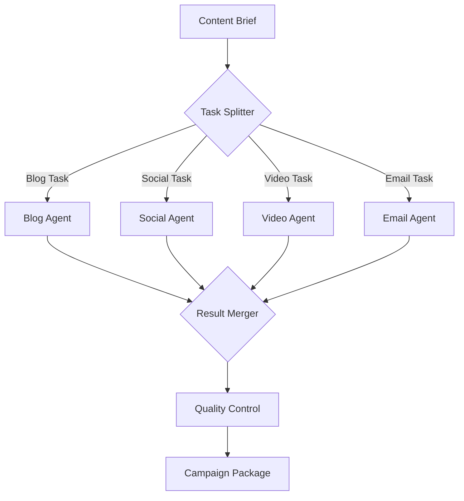

# Exercise 7.1: Advanced Multi-Agent Orchestration

## 🎯 Learning Goals
- Master complex N8N workflow patterns
- Implement parallel agent processing
- Build error recovery mechanisms
- Create sophisticated routing logic

## 📋 Prerequisites
- Completed basic N8N workflows
- Understanding of agent systems
- API integrations working

## 🔨 Task Description

Build an advanced orchestration system that coordinates multiple specialized agents working in parallel to create comprehensive content campaigns.

### Part 1: Parallel Agent Architecture (20 min)

#### Design Parallel Processing System



#### N8N Parallel Execution Setup

```javascript
// Split Execution Node
const brief = $json;
const tasks = [];

// Create parallel tasks
if (brief.requirements.blog) {
  tasks.push({
    type: 'blog',
    agent: 'BlogSpecialist',
    requirements: brief.requirements.blog
  });
}

if (brief.requirements.social) {
  tasks.push({
    type: 'social',
    agent: 'SocialMediaExpert',
    requirements: brief.requirements.social,
    platforms: brief.platforms || ['LinkedIn', 'Twitter']
  });
}

if (brief.requirements.video) {
  tasks.push({
    type: 'video',
    agent: 'VideoCreator',
    requirements: brief.requirements.video
  });
}

if (brief.requirements.email) {
  tasks.push({
    type: 'email',
    agent: 'EmailMarketer',
    requirements: brief.requirements.email
  });
}

// Return array for parallel processing
return tasks.map(task => ({
  json: {
    ...task,
    brief: brief,
    startTime: new Date().toISOString()
  }
}));
```

### Part 2: Specialized Agent Implementation (25 min)

#### Blog Specialist Agent

```javascript
// Blog Creation Workflow
const BlogSpecialist = {
  async process(task, brief) {
    // Multi-step blog creation
    const steps = {
      research: await this.research(brief.topic),
      outline: await this.createOutline(task.requirements),
      draft: await this.writeDraft(task.requirements),
      optimize: await this.optimizeSEO(task.requirements),
      media: await this.generateMedia(task.requirements)
    };
    
    return {
      type: 'blog',
      content: steps.draft,
      media: steps.media,
      seo: steps.optimize,
      metadata: {
        wordCount: steps.draft.split(' ').length,
        readingTime: Math.ceil(steps.draft.split(' ').length / 200),
        keywords: steps.research.keywords
      }
    };
  },
  
  async research(topic) {
    // Deep research with multiple sources
    const searches = [
      `${topic} latest trends 2024`,
      `${topic} best practices`,
      `${topic} case studies`,
      `${topic} statistics data`
    ];
    
    const results = await Promise.all(
      searches.map(q => this.searchAndAnalyze(q))
    );
    
    return this.synthesizeResearch(results);
  }
};
```

#### Social Media Expert Agent

```javascript
// Social Media Content Generator
const SocialMediaExpert = {
  async process(task, brief) {
    const posts = {};
    
    for (const platform of task.platforms) {
      posts[platform] = await this.createPlatformContent(
        platform,
        brief,
        task.requirements
      );
    }
    
    return {
      type: 'social',
      posts: posts,
      schedule: this.optimizeSchedule(posts),
      hashtags: this.generateHashtags(brief.topic)
    };
  },
  
  async createPlatformContent(platform, brief, requirements) {
    const specs = {
      LinkedIn: {
        maxLength: 3000,
        tone: 'professional',
        format: 'long-form',
        media: 'single-image'
      },
      Twitter: {
        maxLength: 280,
        tone: 'casual',
        format: 'thread',
        media: 'up-to-4-images'
      },
      Instagram: {
        maxLength: 2200,
        tone: 'visual',
        format: 'caption',
        media: 'carousel'
      }
    };
    
    const platformSpec = specs[platform];
    
    return {
      text: await this.generateText(brief, platformSpec),
      media: await this.generateMedia(platformSpec.media),
      timing: this.getBestPostTime(platform)
    };
  }
};
```

### Part 3: Error Recovery & Retry Logic (20 min)

#### Implement Robust Error Handling

```javascript
// Error Recovery System
class ErrorRecoverySystem {
  constructor() {
    this.maxRetries = 3;
    this.retryDelay = 2000;
    this.fallbackStrategies = this.initFallbacks();
  }
  
  async executeWithRecovery(agent, task) {
    let lastError;
    
    for (let attempt = 1; attempt <= this.maxRetries; attempt++) {
      try {
        console.log(`Attempt ${attempt} for ${agent.name}`);
        const result = await agent.process(task);
        
        // Validate result
        if (this.validateResult(result)) {
          return result;
        }
        
        throw new Error('Result validation failed');
        
      } catch (error) {
        lastError = error;
        console.error(`Attempt ${attempt} failed:`, error.message);
        
        if (attempt < this.maxRetries) {
          // Exponential backoff
          const delay = this.retryDelay * Math.pow(2, attempt - 1);
          await this.wait(delay);
          
          // Try alternative approach
          task = this.adjustStrategy(task, error);
        }
      }
    }
    
    // All retries failed, use fallback
    return this.fallback(agent, task, lastError);
  }
  
  adjustStrategy(task, error) {
    // Adjust parameters based on error
    if (error.message.includes('token limit')) {
      task.requirements.length = Math.floor(task.requirements.length * 0.8);
    } else if (error.message.includes('rate limit')) {
      task.priority = 'low';
    }
    
    return task;
  }
  
  async fallback(agent, task, error) {
    console.log('Using fallback strategy');
    
    // Try simpler version
    const simplifiedTask = {
      ...task,
      requirements: {
        ...task.requirements,
        quality: 'basic',
        length: 'short'
      }
    };
    
    try {
      return await agent.processSimple(simplifiedTask);
    } catch (fallbackError) {
      // Return error result
      return {
        type: task.type,
        status: 'failed',
        error: error.message,
        fallbackError: fallbackError.message
      };
    }
  }
}

// N8N Error Handler Node
const errorHandler = $json.error;

if (errorHandler) {
  const recovery = {
    strategy: 'retry',
    attempts: $json.attempts || 0,
    maxAttempts: 3
  };
  
  if (recovery.attempts < recovery.maxAttempts) {
    // Retry with adjusted parameters
    return {
      json: {
        ...$json,
        attempts: recovery.attempts + 1,
        adjustments: {
          timeout: 30000,
          reduced_scope: true
        }
      }
    };
  } else {
    // Send to manual review
    return {
      json: {
        status: 'manual_review_required',
        error: errorHandler,
        task: $json
      }
    };
  }
}
```

### Part 4: Dynamic Routing & Conditionals (20 min)

#### Smart Routing Based on Content Type

```javascript
// Dynamic Router
const DynamicRouter = {
  route(content) {
    const routes = [];
    
    // Analyze content to determine routing
    const analysis = this.analyzeContent(content);
    
    // Route based on content characteristics
    if (analysis.technical) {
      routes.push('TechnicalReviewer');
    }
    
    if (analysis.hasStatistics) {
      routes.push('FactChecker');
    }
    
    if (analysis.sensitive) {
      routes.push('ComplianceReviewer');
    }
    
    if (analysis.multimedia) {
      routes.push('MediaProcessor');
    }
    
    // Default route
    if (routes.length === 0) {
      routes.push('StandardProcessor');
    }
    
    return routes;
  },
  
  analyzeContent(content) {
    return {
      technical: /API|SDK|algorithm|protocol/i.test(content),
      hasStatistics: /\d+%|\d+ percent|study shows/i.test(content),
      sensitive: /medical|legal|financial advice/i.test(content),
      multimedia: content.includes('[IMAGE]') || content.includes('[VIDEO]')
    };
  }
};

// N8N Switch Node Configuration
const content = $json.content;
const contentType = $json.type;

// Determine routing path
switch(contentType) {
  case 'technical':
    return [{
      json: {
        ...content,
        route: 'technical_review',
        validators: ['code', 'accuracy', 'completeness']
      }
    }];
    
  case 'marketing':
    return [{
      json: {
        ...content,
        route: 'marketing_review',
        validators: ['brand', 'tone', 'cta']
      }
    }];
    
  case 'educational':
    return [{
      json: {
        ...content,
        route: 'educational_review',
        validators: ['clarity', 'accuracy', 'structure']
      }
    }];
    
  default:
    return [{
      json: {
        ...content,
        route: 'standard_review',
        validators: ['grammar', 'readability']
      }
    }];
}
```

### Part 5: Result Aggregation & Merging (15 min)

#### Merge Parallel Results

```javascript
// Result Aggregator
class ResultAggregator {
  aggregate(results) {
    const campaign = {
      id: this.generateCampaignId(),
      created: new Date().toISOString(),
      components: {},
      metrics: {
        totalTime: 0,
        totalCost: 0,
        agentsUsed: []
      },
      status: 'complete'
    };
    
    // Process each result
    results.forEach(result => {
      if (result.status === 'failed') {
        campaign.status = 'partial';
        campaign.failures = campaign.failures || [];
        campaign.failures.push(result);
      } else {
        campaign.components[result.type] = result;
        campaign.metrics.totalTime += result.processingTime || 0;
        campaign.metrics.totalCost += result.cost || 0;
        campaign.metrics.agentsUsed.push(result.agent);
      }
    });
    
    // Calculate overall quality
    campaign.qualityScore = this.calculateQuality(campaign.components);
    
    // Generate summary
    campaign.summary = this.generateSummary(campaign);
    
    return campaign;
  }
  
  calculateQuality(components) {
    const scores = [];
    
    Object.values(components).forEach(component => {
      if (component.qualityScore) {
        scores.push(component.qualityScore);
      }
    });
    
    if (scores.length === 0) return 0;
    
    const average = scores.reduce((a, b) => a + b, 0) / scores.length;
    return Math.round(average * 10) / 10;
  }
  
  generateSummary(campaign) {
    const componentList = Object.keys(campaign.components).join(', ');
    const failureCount = campaign.failures ? campaign.failures.length : 0;
    
    return {
      description: `Campaign with ${componentList}`,
      successRate: `${Object.keys(campaign.components).length}/${
        Object.keys(campaign.components).length + failureCount
      }`,
      quality: campaign.qualityScore,
      readyForPublish: campaign.qualityScore >= 7 && campaign.status === 'complete'
    };
  }
}

// N8N Merge Node
const results = $items.map(item => item.json);
const aggregator = new ResultAggregator();
const campaign = aggregator.aggregate(results);

return {
  json: campaign
};
```

## 💡 Advanced Patterns

1. **Circuit Breaker Pattern**
```javascript
class CircuitBreaker {
  constructor(threshold = 5) {
    this.failures = 0;
    this.threshold = threshold;
    this.state = 'closed'; // closed, open, half-open
  }
  
  async execute(fn) {
    if (this.state === 'open') {
      throw new Error('Circuit breaker is open');
    }
    
    try {
      const result = await fn();
      this.onSuccess();
      return result;
    } catch (error) {
      this.onFailure();
      throw error;
    }
  }
}
```

2. **Load Balancing**
```javascript
class LoadBalancer {
  constructor(agents) {
    this.agents = agents;
    this.currentIndex = 0;
  }
  
  getNextAgent() {
    const agent = this.agents[this.currentIndex];
    this.currentIndex = (this.currentIndex + 1) % this.agents.length;
    return agent;
  }
}
```

## ✅ Success Criteria

- [ ] Parallel agent execution working
- [ ] Error recovery implemented
- [ ] Dynamic routing functional
- [ ] Results properly aggregated
- [ ] Processing time < 60 seconds

## 🚀 Bonus Challenge

Implement an "Intelligent Orchestrator" that:
1. Learns optimal agent combinations
2. Predicts processing time
3. Auto-scales based on load
4. Implements cost optimization
5. Provides real-time progress updates

## 📊 Expected Output

```json
{
  "campaignId": "camp-2024-0142",
  "status": "complete",
  "components": {
    "blog": {
      "title": "The Future of AI",
      "content": "...",
      "wordCount": 1200,
      "seo": {...}
    },
    "social": {
      "LinkedIn": {...},
      "Twitter": {...}
    },
    "video": {
      "script": "...",
      "mediaUrl": "..."
    },
    "email": {
      "subject": "...",
      "body": "..."
    }
  },
  "metrics": {
    "totalTime": 45.3,
    "parallelTime": 15.2,
    "totalCost": 1.25,
    "agentsUsed": 7
  },
  "qualityScore": 8.7
}
```

## 🔗 Resources

- [N8N Advanced Patterns](../../resources/n8n-advanced.md)
- [Orchestration Best Practices](../../resources/orchestration.md)
- [Error Recovery Strategies](../../resources/error-recovery.md)

## Next Exercise
[Exercise 8.1: Building Autonomous Agents →](../08-agents/autonomous-agents.md)
