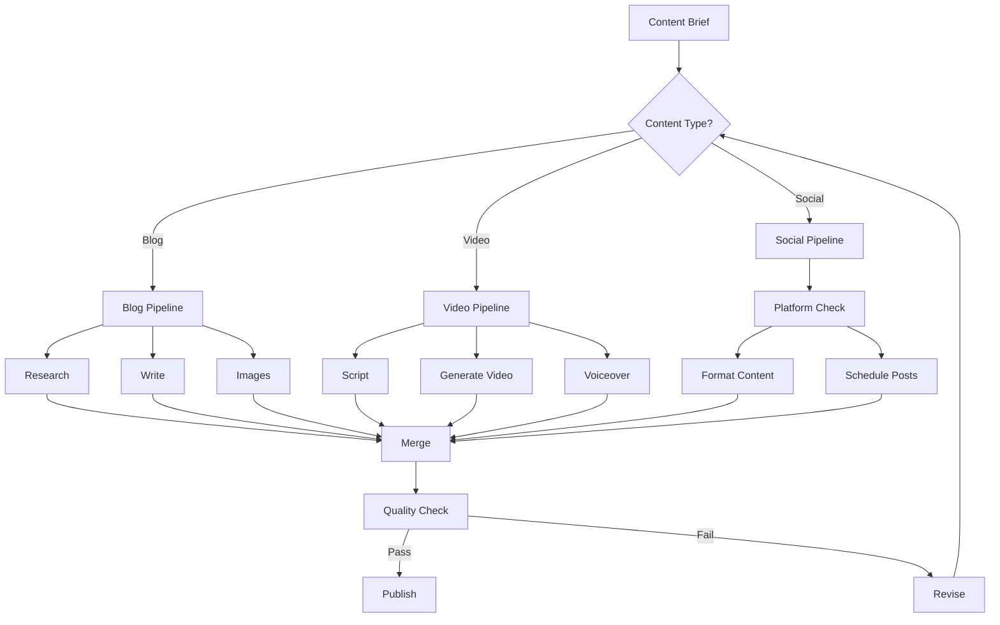

# Exercise 7.1: Advanced Multi-Branch Workflows

## 🎯 Learning Goals
- Master conditional branching in N8N
- Implement parallel processing
- Build error recovery mechanisms
- Create sub-workflows for modularity

## 📋 Prerequisites
- Completed basic N8N workflows
- Understanding of conditional logic
- API integration knowledge

## 🔨 Task Description

Build a sophisticated content processing pipeline with multiple branches, parallel execution, and intelligent routing for ContentFlow AI.

### Part 1: Multi-Branch Architecture (20 min)

#### Design Complex Workflow Structure



#### Implement Switch Node Logic
```javascript
// Content Type Router
function routeContent(input) {
  const contentType = input.brief.type;
  const priority = input.brief.priority || 'normal';
  
  // Define routing rules
  const routes = {
    blog: {
      branches: ['research', 'writing', 'media'],
      parallel: true,
      timeout: 1800000 // 30 min
    },
    video: {
      branches: ['script', 'video_gen', 'audio'],
      parallel: true,
      timeout: 3600000 // 60 min
    },
    social: {
      branches: ['platform_format', 'scheduling'],
      parallel: false,
      timeout: 600000 // 10 min
    },
    campaign: {
      branches: ['blog', 'video', 'social'],
      parallel: true,
      timeout: 7200000 // 2 hours
    }
  };
  
  // Handle priority routing
  if (priority === 'urgent') {
    routes[contentType].parallel = false;
    routes[contentType].timeout = routes[contentType].timeout / 2;
  }
  
  return routes[contentType] || routes.blog;
}
```

### Part 2: Parallel Processing Implementation (25 min)

#### Build Parallel Execution Nodes

##### Parallel Blog Content Generation
```javascript
// Split execution for parallel processing
const parallelTasks = {
  // Task 1: Research Branch
  research: async () => {
    const topics = $json.brief.topics;
    const research = await Promise.all(
      topics.map(topic => fetchResearch(topic))
    );
    return { research: combineResearch(research) };
  },
  
  // Task 2: Writing Branch
  writing: async () => {
    const outline = await generateOutline($json.brief);
    const sections = await Promise.all(
      outline.sections.map(section => writeSection(section))
    );
    return { content: sections.join('\n\n') };
  },
  
  // Task 3: Media Branch
  media: async () => {
    const mediaPromises = [
      generateHeroImage($json.brief.title),
      generateSocialImages($json.brief.title),
      findStockPhotos($json.brief.keywords)
    ];
    const [hero, social, stock] = await Promise.all(mediaPromises);
    return { media: { hero, social, stock } };
  }
};

// Execute all branches in parallel
async function executeParallel() {
  const startTime = Date.now();
  
  try {
    const results = await Promise.allSettled([
      parallelTasks.research(),
      parallelTasks.writing(),
      parallelTasks.media()
    ]);
    
    // Combine results
    const combined = results.reduce((acc, result) => {
      if (result.status === 'fulfilled') {
        return { ...acc, ...result.value };
      } else {
        console.error('Task failed:', result.reason);
        return acc;
      }
    }, {});
    
    return {
      ...combined,
      executionTime: Date.now() - startTime,
      parallelExecuted: true
    };
  } catch (error) {
    return handleParallelError(error);
  }
}
```

##### Merge Node Configuration
```javascript
// Merge parallel branch results
function mergeResults(inputs) {
  // inputs is an array of results from parallel branches
  const merged = {
    content: {},
    media: {},
    metadata: {},
    errors: []
  };
  
  inputs.forEach((input, index) => {
    if (input.error) {
      merged.errors.push({
        branch: index,
        error: input.error
      });
    } else {
      // Merge content
      if (input.content) {
        merged.content = { ...merged.content, ...input.content };
      }
      // Merge media
      if (input.media) {
        merged.media = { ...merged.media, ...input.media };
      }
      // Merge metadata
      if (input.metadata) {
        merged.metadata = { ...merged.metadata, ...input.metadata };
      }
    }
  });
  
  // Check if enough branches succeeded
  const successRate = (inputs.length - merged.errors.length) / inputs.length;
  
  if (successRate < 0.5) {
    throw new Error('Too many parallel branches failed');
  }
  
  return merged;
}
```

### Part 3: Sub-Workflows (20 min)

#### Create Reusable Sub-Workflows

##### SEO Optimization Sub-Workflow
```javascript
// sub-workflow-seo.json
{
  name: "SEO Optimizer",
  trigger: "execute",
  
  nodes: [
    {
      name: "Analyze Content",
      type: "function",
      code: `
        const content = $input.item.json.content;
        const keywords = $input.item.json.keywords;
        
        return {
          wordCount: content.split(' ').length,
          keywordDensity: calculateDensity(content, keywords),
          headings: extractHeadings(content),
          metaDescription: generateMeta(content)
        };
      `
    },
    {
      name: "Optimize",
      type: "claude-ai",
      prompt: "Optimize this content for SEO..."
    },
    {
      name: "Validate",
      type: "function",
      code: "// Validate SEO improvements"
    }
  ]
}

// Main workflow calling sub-workflow
const executeSeoOptimization = {
  type: "n8n-nodes-base.executeWorkflow",
  parameters: {
    workflowId: "{{$json.seoWorkflowId}}",
    inputData: {
      content: "{{$json.content}}",
      keywords: "{{$json.keywords}}"
    }
  }
};
```

##### Error Recovery Sub-Workflow
```javascript
// Error recovery mechanism
const errorRecoveryFlow = {
  name: "Error Recovery",
  
  async execute(error, context) {
    const recovery = {
      attempted: [],
      successful: false,
      finalResult: null
    };
    
    // Strategy 1: Retry with backoff
    if (error.type === 'rate_limit' || error.type === 'timeout') {
      recovery.attempted.push('retry');
      
      for (let i = 1; i <= 3; i++) {
        await this.wait(Math.pow(2, i) * 1000); // Exponential backoff
        
        try {
          recovery.finalResult = await this.retryOperation(context);
          recovery.successful = true;
          break;
        } catch (retryError) {
          console.log(`Retry ${i} failed:`, retryError);
        }
      }
    }
    
    // Strategy 2: Fallback to alternative
    if (!recovery.successful && error.type === 'api_error') {
      recovery.attempted.push('fallback');
      
      try {
        recovery.finalResult = await this.executeFallback(context);
        recovery.successful = true;
      } catch (fallbackError) {
        console.log('Fallback failed:', fallbackError);
      }
    }
    
    // Strategy 3: Degraded mode
    if (!recovery.successful) {
      recovery.attempted.push('degraded');
      recovery.finalResult = this.degradedResponse(context);
      recovery.successful = true;
    }
    
    return recovery;
  }
};
```

### Part 4: Loop Implementation (15 min)

#### Build Iterative Processing

##### Batch Content Processor
```javascript
// Process multiple content items with loop
const batchProcessor = {
  items: $json.contentBatch,
  results: [],
  
  async processAll() {
    // Using SplitInBatches node concept
    const batchSize = 5;
    const batches = [];
    
    for (let i = 0; i < this.items.length; i += batchSize) {
      batches.push(this.items.slice(i, i + batchSize));
    }
    
    // Process each batch
    for (const batch of batches) {
      const batchResults = await this.processBatch(batch);
      this.results.push(...batchResults);
      
      // Add delay between batches to avoid rate limits
      await this.delay(2000);
    }
    
    return this.results;
  },
  
  async processBatch(batch) {
    // Process items in parallel within batch
    const promises = batch.map(item => this.processItem(item));
    return await Promise.all(promises);
  },
  
  async processItem(item) {
    try {
      // Process individual content item
      const result = await generateContent(item);
      return { success: true, item: item.id, result };
    } catch (error) {
      return { success: false, item: item.id, error: error.message };
    }
  }
};
```

##### Iterative Quality Improvement
```javascript
// Loop until quality threshold met
const qualityLoop = {
  maxIterations: 5,
  targetScore: 8.5,
  
  async improveContent(content) {
    let currentContent = content;
    let iteration = 0;
    let qualityScore = 0;
    
    while (iteration < this.maxIterations && qualityScore < this.targetScore) {
      // Analyze current quality
      qualityScore = await this.assessQuality(currentContent);
      
      if (qualityScore >= this.targetScore) {
        break;
      }
      
      // Get improvement suggestions
      const suggestions = await this.getSuggestions(currentContent, qualityScore);
      
      // Apply improvements
      currentContent = await this.applyImprovements(currentContent, suggestions);
      
      iteration++;
    }
    
    return {
      finalContent: currentContent,
      finalScore: qualityScore,
      iterations: iteration,
      improved: qualityScore >= this.targetScore
    };
  }
};
```

### Part 5: Advanced Error Handling (20 min)

#### Implement Comprehensive Error Management

```javascript
// Global error handler
class WorkflowErrorHandler {
  constructor() {
    this.errorLog = [];
    this.recoveryStrategies = new Map();
    this.initStrategies();
  }
  
  initStrategies() {
    // API errors
    this.recoveryStrategies.set('api_error', {
      retry: true,
      retries: 3,
      backoff: 'exponential',
      fallback: 'alternative_api'
    });
    
    // Rate limits
    this.recoveryStrategies.set('rate_limit', {
      retry: true,
      retries: 5,
      backoff: 'linear',
      delay: 60000
    });
    
    // Content errors
    this.recoveryStrategies.set('content_error', {
      retry: false,
      fallback: 'regenerate',
      notify: true
    });
  }
  
  async handleError(error, context) {
    // Log error
    this.errorLog.push({
      timestamp: new Date().toISOString(),
      error: error.message,
      context: context,
      stack: error.stack
    });
    
    // Get recovery strategy
    const strategy = this.recoveryStrategies.get(error.type) || 
                    this.recoveryStrategies.get('default');
    
    // Execute recovery
    if (strategy.retry) {
      return await this.retryWithStrategy(strategy, context);
    } else if (strategy.fallback) {
      return await this.executeFallback(strategy.fallback, context);
    } else {
      // No recovery possible
      await this.notifyAdmin(error, context);
      throw error;
    }
  }
  
  async retryWithStrategy(strategy, context) {
    for (let i = 0; i < strategy.retries; i++) {
      // Calculate delay
      const delay = strategy.backoff === 'exponential' 
        ? Math.pow(2, i) * 1000 
        : strategy.delay || 1000;
      
      await new Promise(resolve => setTimeout(resolve, delay));
      
      try {
        return await context.operation();
      } catch (retryError) {
        if (i === strategy.retries - 1) {
          throw retryError;
        }
      }
    }
  }
}
```

## ✅ Success Criteria

- [ ] Multi-branch workflow executing correctly
- [ ] Parallel processing implemented
- [ ] Sub-workflows created and callable
- [ ] Loop processing working
- [ ] Error handling comprehensive
- [ ] Performance optimized

## 🚀 Bonus Challenge

Create a "Smart Workflow Optimizer" that:
1. Monitors execution times per branch
2. Identifies bottlenecks automatically
3. Suggests workflow improvements
4. Auto-scales parallel execution
5. Predicts failure points

## 📊 Expected Output

```json
{
  "workflow": "Advanced Multi-Branch Pipeline",
  "execution": {
    "totalTime": 45.3,
    "branches": {
      "blog": { "time": 25.1, "status": "success" },
      "video": { "time": 45.3, "status": "success" },
      "social": { "time": 8.7, "status": "success" }
    },
    "parallelExecution": true,
    "subWorkflowsCalled": 3
  },
  "results": {
    "contentGenerated": 5,
    "mediaCreated": 12,
    "errorsRecovered": 2,
    "successRate": "100%"
  },
  "optimization": {
    "bottleneck": "video_generation",
    "suggestion": "Cache video templates",
    "estimatedImprovement": "30%"
  }
}
```

## Next Exercise
[Exercise 8.1: Building Content Agents →](../08-agents/content-agents.md)
